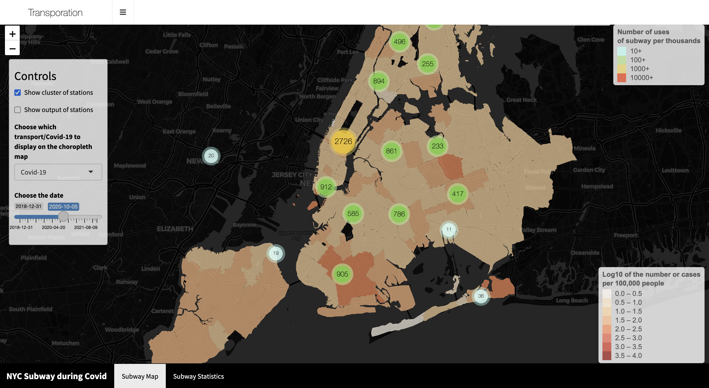

# Project 2: Shiny App Development

### [Project Description](doc/project2_desc.md)



In this second project of GR5243 Applied Data Science, we develop a *Exploratory Data Analysis and Visualization* shiny app on the work of a **NYC government agency/program** of your choice using NYC open data released on the [NYC Open Data By Agency](https://opendata.cityofnewyork.us/data/) website. In particular, many agencies have adjusted their work or rolled out new programs due to COVID, your app should provide ways for a user to explore quantiative measures of how covid has impacted daily life in NYC from different prospectives. See [Project 2 Description](doc/project2_desc.md) for more details.  

The **goals** for this project is:

- business intelligence for data science
- data cleaning
- data visualization
- systems development/design life cycle
- shiny app/shiny server

*The above general statement about project 2 can be removed once you are finished with your project. It is optional.

## NYC Public Transport during the COVID-19 Pandemic
Term: Spring 2022

+ Team 8
+ **Visualizing the Effect of COVID-19 on Public Transport**:
	+ Clement, Micol
	+ Limpijankit, Marvin
	+ Nakamura, Shintaro
	+ Xu, Rong

+ **Project summary**: Leveraging the vast amount of open data from sources online, our Shiny App aims to illustrate the impact of the COVID-19 pandemic on various sectors of the public transport system in New York. This app examines a range of transport systems, namely Citibikes, Yellow Taxis, and Subways in relation to COVID-19. The results provide insight into the different ways people have adapted their transportation needs in accordance with the pandemic, and how the transport system has been recovering from the effects of the pandemic. 

+ **Contribution statement**: ([default](doc/a_note_on_contributions.md)) All team members contributed equally in the preliminary planning stages of this project. Shintaro and Rong took initiative in creating the base dashboard for the project and streaming the Shiny app respectively. All team members then contributed their part to the project, Shintaro working on the Covid data and location mapping for the various map visualizations, Rong working on cleaning and displaying Citibike data, Clement on analyzing and presenting the subway data, and Marvin for aggregating and cleaning the taxi data and creating the visualizations for them. 

Following [suggestions](http://nicercode.github.io/blog/2013-04-05-projects/) by [RICH FITZJOHN](http://nicercode.github.io/about/#Team) (@richfitz). This folder is orgarnized as follows.

```
proj/
├── app/
├── lib/
├── data/
├── doc/
```

Please see each subfolder for a README file.

